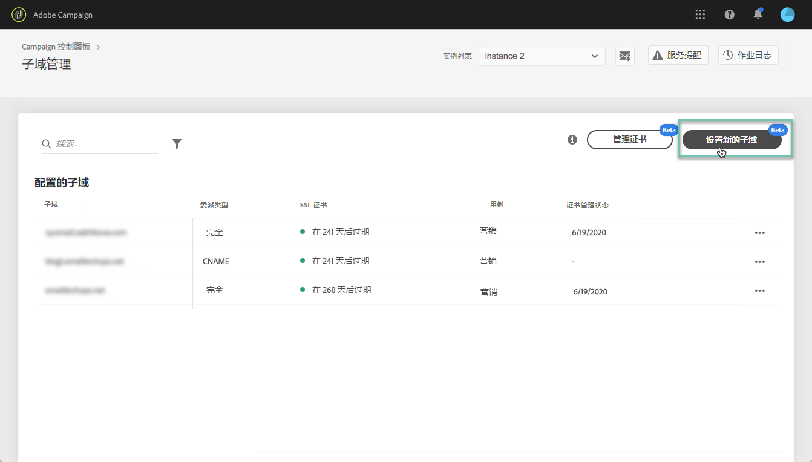
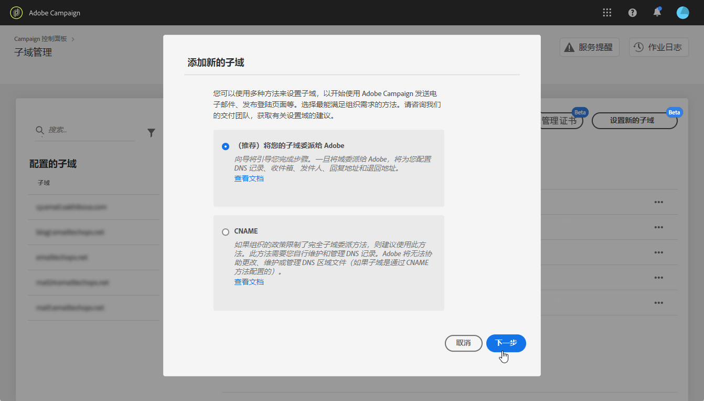
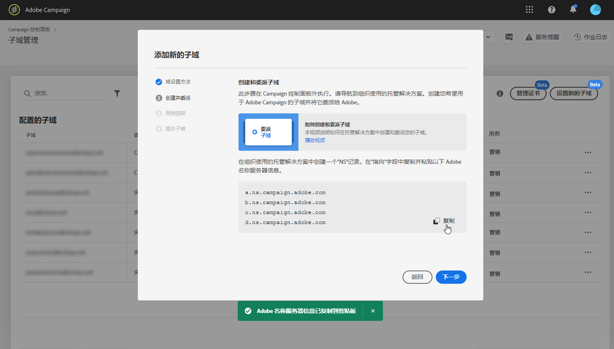
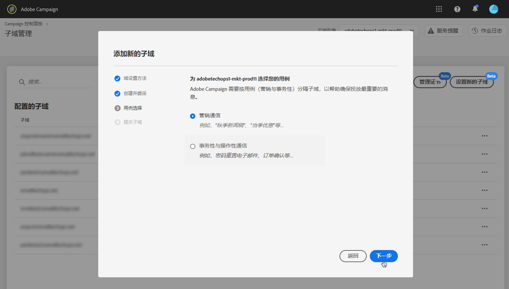
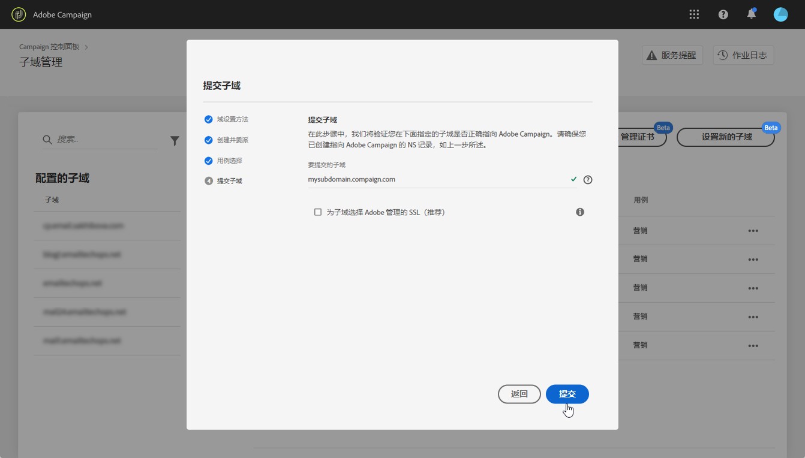
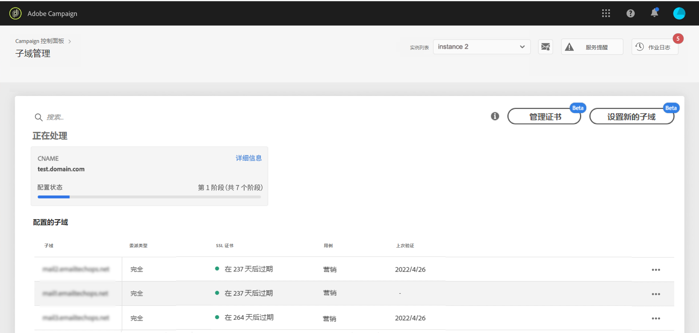
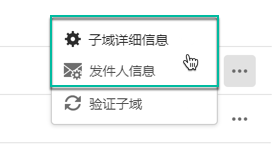
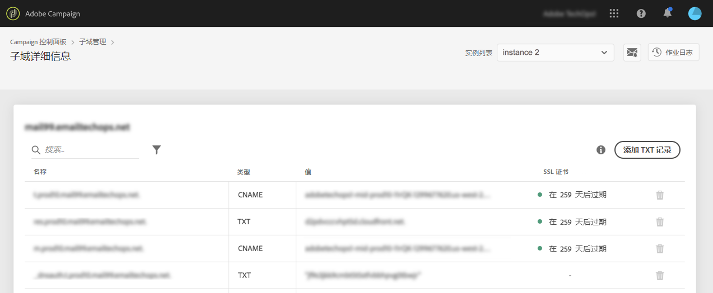
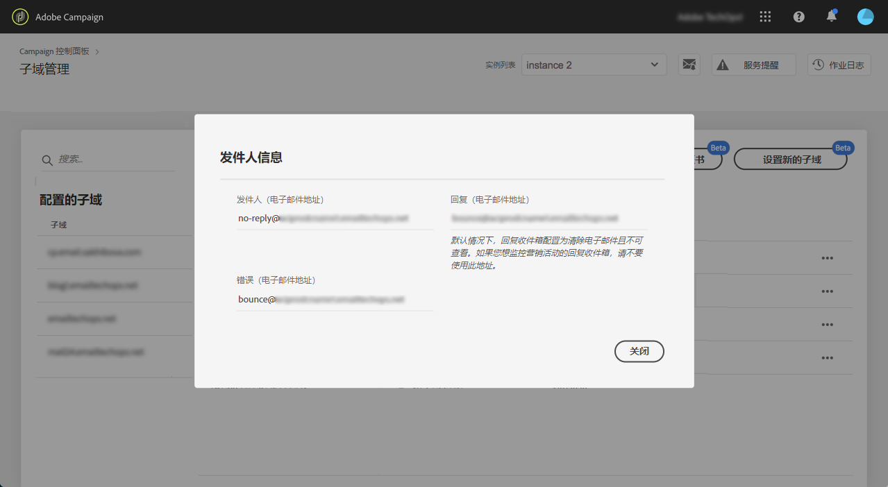

# 设置新子域 {#setting-up-subdomain}

>[!CONTEXTUALHELP]
>id="cp_subdomain_management"
>title="设置新子域并管理证书"
>abstract="您需要设置一个新的子域并管理子域的SSL证书，以开始发送电子邮件或发布具有Adobe Campaign的登陆页。"
>additional-url="https://docs.adobe.com/content/help/en/control-panel/using/subdomains-and-certificates/monitoring-ssl-certificates.html" text="如何监视子域的SSL证书"

>[!IMPORTANT]
>
>控制面板中的子域委派在测试版中可用，如有频繁更新和修改，恕不另行通知。

## 完全子域委派 {#full-subdomain-delegation}

控制面板允许您将子域完全委派给Adobe Campaign。 为此，请按照以下步骤操作。

>[!NOTE]
>
>如果所选实例之前没有配置子域，则委派给Adobe的第一个子域 **将成为该实例的主子域** ，您将来将无法更改它。
>
>将使用主子域为其他子域创建反向DNS记录。 其他子域的回复地址和跳回地址将从主子域生成。

1. 在卡 **[!UICONTROL Subdomains & Certificates]** 中，选择所需的生产实例，然后单击 **[!UICONTROL Setup new subdomain]**。

   

   >[!NOTE]
   >
   >子域委托仅可用于 **生产** 实例。

1. 单击 **[!UICONTROL Next]** 以确认完整委派方法。

   

   >[!NOTE]
   >
   >[控制面板](#use-cnames) 当前不支持CNAME和自定义方法。

1. 在您的组织使用的托管解决方案中创建所需的子域和命名空间。 为此，请复制并粘贴向导中显示的Adobe Nameserver信息。 有关如何在托管解决方案中创建子域的详细信息，请参阅教 [程视频](https://video.tv.adobe.com/v/30175?captions=chi_hans)。

   >[!IMPORTANT]
   >
   >配置命名空间器时，请确 **保从不将根子域委托给Adobe**。 否则，域将仅能与Adobe一起使用。 任何其他用途都不可能实现，例如向组织的员工发送内部电子邮件。
   >
   >此外， **不要为此新子域创建单独** 的区域文件。

   

   使用相应的Adobe命名空间服务器信息创建子域后，单击 **[!UICONTROL Next]**。

1. 为子域选择所需的用例：

   * **营销通讯**: 用于商业目的的通信。 示例： 销售电子邮件活动
   * **交易和运营通信**: 事务性通信包含旨在完成收件人已开始的流程的信息。 示例： 购买确认、密码重置电子邮件。 组织通信与组织内外的信息、想法和视图交流有关，无商业目的。
   

   **根据用例划分子域是交付性的最佳实践**。 这样，每个子域的信誉都被隔离和保护。 例如，如果营销通信的子域最终被Internet服务提供商已列入黑名单，您的事务通信子域将不受影响，并且将能够继续发送通信。

   **您可以为Marketing和Transactional用例委派子域**:

   * 对于营销用例，子域将配置在 **MID** （中间采购）实例上。
   * 对于事务性用例，子域将配置在 **ALL** （消息中心／实时消息）实例上，以确保连接性。 因此，子域将对您的所有RT实例进行操作。
   >[!NOTE]
   >
   >如果您使用Campaign Classic，控制面板允许您查看哪些RT/MID实例已连接到您正在处理的营销实例。 如需详细信息，请参阅[此部分](../../instances-settings/using/instance-details.md)。

1. 在托管解决方案中输入您创建的子域，然后单击 **[!UICONTROL Submit]**。

   确保填写要委 **托的子** 域的全名。 例如，要委派“usoffers.email.weretail.com”子域，请键入“usoffers.email.weretail.com”。

   

1. 提交子域后，控制面板将检查它是否正确指向Adobe NS记录，以及此子域不存在“授权开始”(SOA)记录。

   >[!NOTE]
   >
   >请注意，当子域委派运行时，通过控制面板的其他请求将输入队列并仅在子域委派完成后执行，以防止出现任何性能问题。

1. 如果检查成功，控制面板将开始设置包含DNS记录、其他URL、收件箱等的子域。

   最终，将通知Deliverability团队有关新子域的信息，以便对其进行审核。 在子域被委派后，审核过程最长可能需要3-10个工作日。 执行的检查包括反馈循环和垃圾邮件投诉循环测试。 因此，我们不建议在审计完成之前使用子域，因为它可能导致子域声誉不佳。

   您可以通过单击按钮获取有关配置进度的更多详 **[!UICONTROL Process details]** 细信息。

   

   >[!NOTE]
   >
   >在某些情况下，委派会完成，但子域可能无法成功验证。 子域将保留在列表中， **[!UICONTROL Processing]** 作业日志提供有关该错误的信息。 如果您在解决问题时遇到问题，请与客户服务联系。

在流程结束时，子域将配置为与Adobe Campaign实例一起使用，并将创建以下元素：

* **具有以下DNS记录的子域**: SOA、MX、CNAME、DKIM、SPF、TXT、
* **用于托管镜像** 、资源、跟踪页面和域密钥的其他子域，
* **收件箱**: 发件人、错误、回复。

   默认情况下，控制面板中的“回复”收件箱配置为清除电子邮件且不可再查看。 如果要监视营销活动的“回复”收件箱，请勿使用此地址。

您可以通过单击和按钮获取有关子域的更 **[!UICONTROL Subdomain details]** 多详细 **[!UICONTROL Sender info]** 信息。

## 使用CNAME {#use-cnames}

控制面板不支持使用CNAME进行子域委派。 要使用此方法，请与Adobe客户关怀部门联系。

**相关主题：**

* [委派子域（教程视频）](https://docs.adobe.com/content/help/en/campaign-learn/campaign-standard-tutorials/administrating/control-panel/subdomain-delegation.html)
* [子域品牌](../../subdomains-certificates/using/subdomains-branding.md)
* [监视子域](../../subdomains-certificates/using/monitoring-subdomains.md)