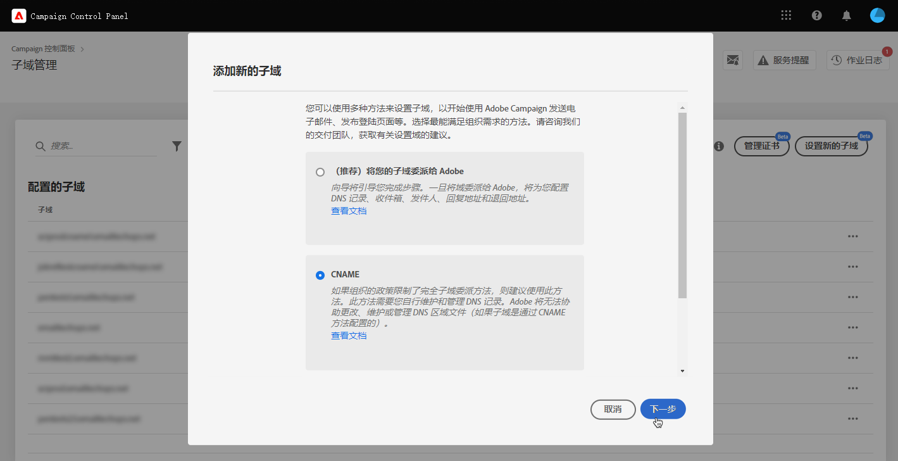
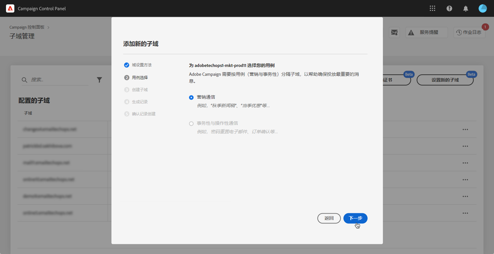
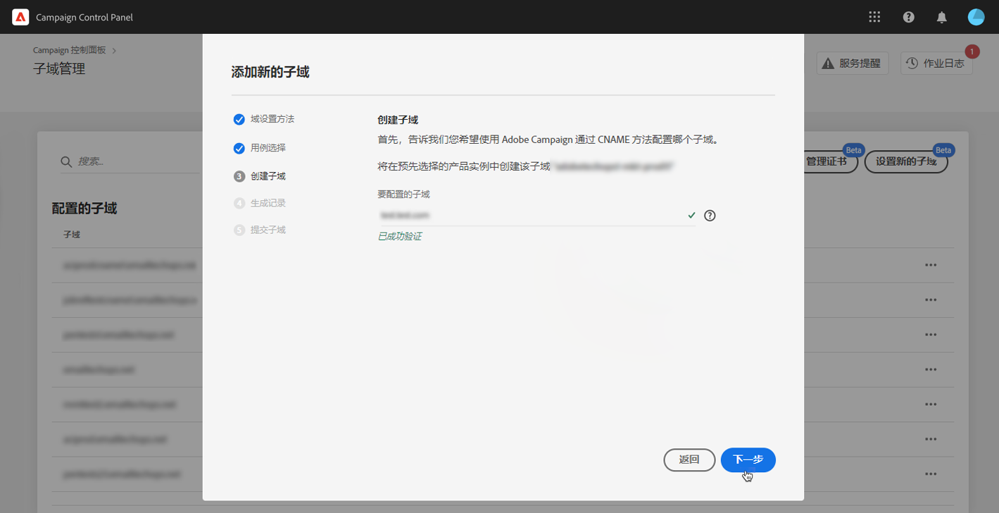
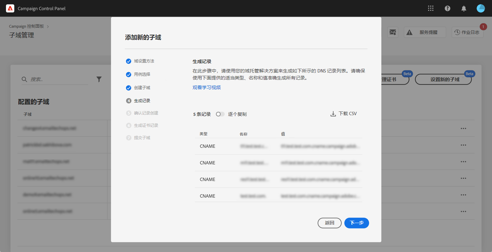
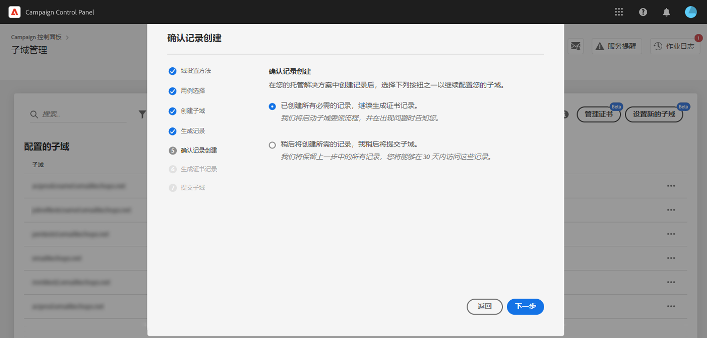
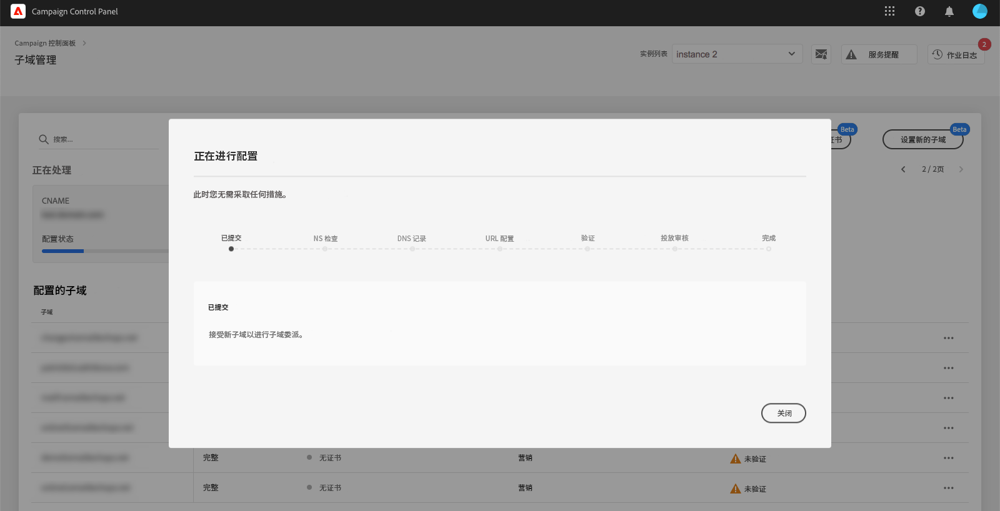

# 设置新子域 {#setting-up-subdomain}

>[!CONTEXTUALHELP]
>id="cp_subdomain_management"
>title="设置新子域并管理证书"
>abstract="您需要设置一个新子域并管理子域的 SSL 证书，以开始使用 Adobe Campaign 发送电子邮件或发布登陆页面。"
>additional-url="https://docs.adobe.com/content/help/zh-Hans/control-panel/using/subdomains-and-certificates/monitoring-ssl-certificates.html" text="如何监控子域的 SSL 证书"

>[!IMPORTANT]
>
>控制面板的子域配置在测试版中可用，并且如有频繁更新和修改，恕不另行通知。

本页提供了如何使用完全子域委派或CNAME设置新子域的信息。 本节介绍了这两种方法的全局概念： .

**相关主题：**

* [委派子域（教程视频）](https://docs.adobe.com/content/help/en/campaign-learn/campaign-standard-tutorials/administrating/control-panel/subdomain-delegation.html)
* [使用CNAME配置子域](https://docs.adobe.com/content/help/en/campaign-classic-learn/control-panel/subdomains-and-certificates/delegating-subdomains-using-cname.html)
* [监控子域](../../subdomains-certificates/using/monitoring-subdomains.md)

## 必读 {#must-read}

### 实例选择

Subdomain configuration is available for **production** instances only.

如果您在向导中选择的实例之前没有设置子域，则第一个配置的子域将成为该 **实例的主子域** ，而您将来将无法更改它。

因此，将使用 **此主子域** ，为其他子域创建反向DNS记录。 **其他子域的回复地址和退回地址将从主子域生成。**

### 命名空间配置

配置名称服务器时，请确保&#x200B;**从不将根子域委派给 Adobe**。否则，域将仅能与 Adobe 配合使用。任何其他用途都不可能实现，例如向组织的员工发送内部电子邮件。

此外，**不要为此新子域创建单独的区域文件**。

## 完全子域委派 {#full-subdomain-delegation}

要将子域完全委派给Adobe Campaign，请执行以下步骤：

1. 在 **[!UICONTROL Subdomains & Certificates]**&#x200B;卡中，选择所需的生产实例，然后单击 **[!UICONTROL Setup new subdomain]**。

   

1. 单击 **[!UICONTROL Next]**&#x200B;以确认完整委派方法。

   

1. 在您的组织使用的托管解决方案中创建所需的子域和名称服务器。为此，请复制并粘贴向导中显示的 Adobe 名称服务器信息。有关如何在托管解决方案中创建子域的详细信息，请参阅[教程视频](https://video.tv.adobe.com/v/30175?captions=chi_hans)。

   

1. 在使用相应的 Adobe 名称服务器信息创建子域后，单击 **[!UICONTROL Next]**。

1. 如果选择了Campaign Classic实例，请为子域选择所需的用例： **营销通信** 或交 **易和运营通信**。 本节介绍子域用例的全 [局概念](../../subdomains-certificates/using/subdomains-branding.md#about-subdomains-use-cases)。

   

1. 输入您在托管解决方案中创建的子域，然后单击 **[!UICONTROL Submit]**。

   确保填写要委派的子域的&#x200B;**全名**。例如，要委派“usoffers.email.weretail.com”子域，请键入“usoffers.email.weretail.com”。

   

提交子域后，控制面板将执行各种检查和配置步骤。 有关此方面的详 []细信息，请参阅(../../subdomains-certificates/using/setting-up-new-subdomain.md#subdomain-checks-and-configuration)。

## 使用CNAME的子域配置 {#use-cnames}

要使用CNAME配置子域，请执行以下步骤：

1. 在 **[!UICONTROL Subdomains & Certificates]**&#x200B;卡中，选择所需的生产实例，然后单击 **[!UICONTROL Setup new subdomain]**。

   

1. Select the **[!UICONTROL CNAME]** method, then click **[!UICONTROL Next]**.

   

1. 如果选择了Campaign Classic实例，请为子域选择所需的用例： **营销通信** 或交 **易和运营通信**。 本节介绍子域用例的全 [局概念](../../subdomains-certificates/using/subdomains-branding.md#about-subdomains-use-cases)。

   

1. 输入您在托管解决方案中创建的子域，然后单击 **[!UICONTROL Next]**。

   Make sure you fill in the **full name** of the subdomain to setup. 例如，要配置“usoffers.email.weretail.com”子域，请键入“usoffers.email.weretail.com”。

   

1. 将显示要放入DNS服务器的记录列表。 逐个复制这些记录，或通过下载CSV文件，然后导航到您的域托管解决方案以生成匹配的DNS记录。

   

1. 确保之前步骤中的所有DNS记录均已生成到域托管解决方案中。 如果所有内容都配置正确，请选择第一个语句，然后单 **[!UICONTROL Submit]** 击进行确认。

   

   >[!NOTE]
   >
   >如果要创建记录并稍后提交子域配置，请选择第二个语句，然后单击 **[!UICONTROL Submit later]**。 然后，您将能够直接从子域管理屏幕区域恢复子域 **[!UICONTROL Processing]** 配置。
   >
   >请注意，要放置到服务器上的DNS记录将由控制面板保存30天。 在此期间之后，您必须从头开始配置子域。

提交子域后，控制面板将执行各种检查和配置步骤。 有关详细信息，请参阅 。

## 子域检查和配置 {#subdomain-checks-and-configuration}

1. 提交子域后，控制面板将检查它是否正确指向AdobeNS记录，以及此子域不存在权限开始(SOA)记录。

   >[!NOTE]
   >
   >请注意，当子域配置运行时，通过控制面板的其他请求将输入队列并仅在子域配置完成后执行，以防止出现任何性能问题。

1. 如果检查成功，控制面板将开始设置包含 DNS 记录、其他 URL、收件箱等的子域。

   

   You can get more details on the configuration progress by clicking the subdomain configuration **[!UICONTROL Details]** button.

   

1. 最终，**可交付性团队**&#x200B;将收到有关新子域的通知，以便对其进行审核。在子域配置完成后，审核过程最长可能需要10个工作日。

   >[!IMPORTANT]
   >
   >执行的交付性检查包括反馈循环和垃圾邮件投诉循环测试。 因此，我们不建议在审核完成之前使用子域，因为它可能导致子域声誉受损。

1. 在流程结束时，子域将配置为与 Adobe Campaign 实例配合使用，并将创建以下元素：

   * **具有以下 DNS 记录的子域**：SOA、MX、CNAME、DKIM、SPF、TXT；
   * 用于托管镜像、资源、跟踪页面和域密钥的&#x200B;**其他子域**；
   * **收件箱**：发件人、错误、回复。

   默认情况下，控制面板中的“回复”收件箱配置为清除电子邮件且不可查看。如果要监控营销活动的“回复”收件箱，请勿使用此地址。

您可以通过单击 **[!UICONTROL Subdomain details]**&#x200B;和 **[!UICONTROL Sender info]** 按钮获取有关子域的更多详细信息。

## 故障排除 {#troubleshooting}

* 在某些情况下，子域配置会完成，但子域可能无法成功验证。 子域将保留在&#x200B;**[!UICONTROL Configured]**&#x200B;列表中，作业日志提供有关该错误的信息。如果您在解决此问题时遇到麻烦，请联系客户关怀团队。
* 如果子域在配置后显示为“未验证”，则启动新的子域验证（**...** / **[!UICONTROL Verify subdomain]**）。如果它仍显示相同的状态，原因可能是对收件人模式进行了一些自定义操作，无法使用标准流程进行验证。请尝试使用该子域发送活动。
* 如果子域配置在可交付性审核步骤中耗时过长（超过 10 个工作日），请联系客户关怀。
